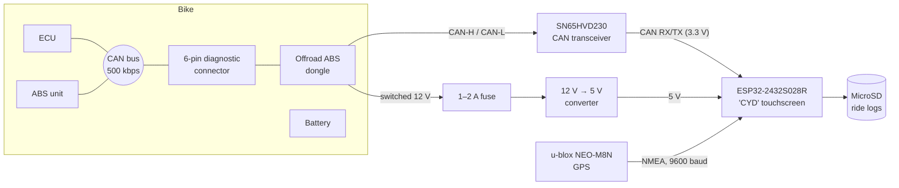

# KTM Computer

A DIY dashboard and data logger for a **2020 KTM 690 Enduro R**, which has
no instrument cluster. An ESP32 "Cheap Yellow Display" reads the bike's
factory CAN bus (read-only) and a GPS module, shows a live dash on a 2.8"
touchscreen, keeps trip stats and charts, and logs everything to a MicroSD
card.

## What it does

- **Dashboard:** RPM with a colour-zoned tach bar and shift light, gear,
  speed (from the wheel sensor), coolant temperature, GPS heading,
  elevation, satellites, and the local time from GPS.
- **Trip and history pages:** distance, ride and moving time, maximums,
  climb and descent; charts of elevation, speed (wheel vs GPS) and coolant;
  time in each RPM zone. Every ride is saved, and `<` `>` buttons step
  through past rides.
- **CAN sniffer pages:** every CAN ID on the bus with its rate and live
  bytes, for reverse-engineering more signals.
- **Logging:** every CAN frame and GPS sentence to the SD card, one file per
  key-on, oldest deleted automatically when the card fills.
- **Read-only:** the CAN controller runs in listen-only mode. See the
  [wiring guide](docs/wiring.md#make-the-tap-truly-read-only) for the
  hardware change that guarantees it.

## Documentation

| Doc | What's in it |
|---|---|
| [Parts list](docs/parts-list.md) | Everything used in the build |
| [Wiring](docs/wiring.md) | Every wire: bike, power, transceiver, GPS, with pin tables |
| [Build guide](docs/build-guide.md) | Step by step: tools, flashing, wiring, testing on the bike |
| [Using the dash](docs/using-the-dash.md) | Pages, taps, long presses, ride history |
| [CAN signals](docs/can-signals.md) | What each CAN ID and byte means on this bike |
| [Log format](docs/log-format.md) | What's in the SD card logs and how to read them |
| [Firmware](docs/firmware.md) | Code layout, tests, settings you might change |
| [Troubleshooting](docs/troubleshooting.md) | Problems hit during the build and how they were found |
| [Roadmap](docs/roadmap.md) | What's done and what's next |
| [Captures](captures/README.md) | Raw CAN logs from the bike |

## Quick start (firmware)

1. Install [VS Code](https://code.visualstudio.com/) and the
   [PlatformIO](https://platformio.org/install/ide?install=vscode) extension.
2. Clone this repo and open the folder in VS Code.
3. Plug the CYD into the computer by USB and press **Upload** in the
   PlatformIO toolbar (or run `pio run -e esp32dev -t upload`).
4. Run the unit tests on the computer with `pio test -e native`.

See the [build guide](docs/build-guide.md) for the hardware.

## Credits

The starting point for the CAN decoding is
[blalor/ktm-can](https://github.com/blalor/ktm-can), also from a 2020 690
Enduro R, built on Dan Plastina's SuperDuke 1290 work on ADVrider. This
project confirmed and extended it from its own ride logs.
