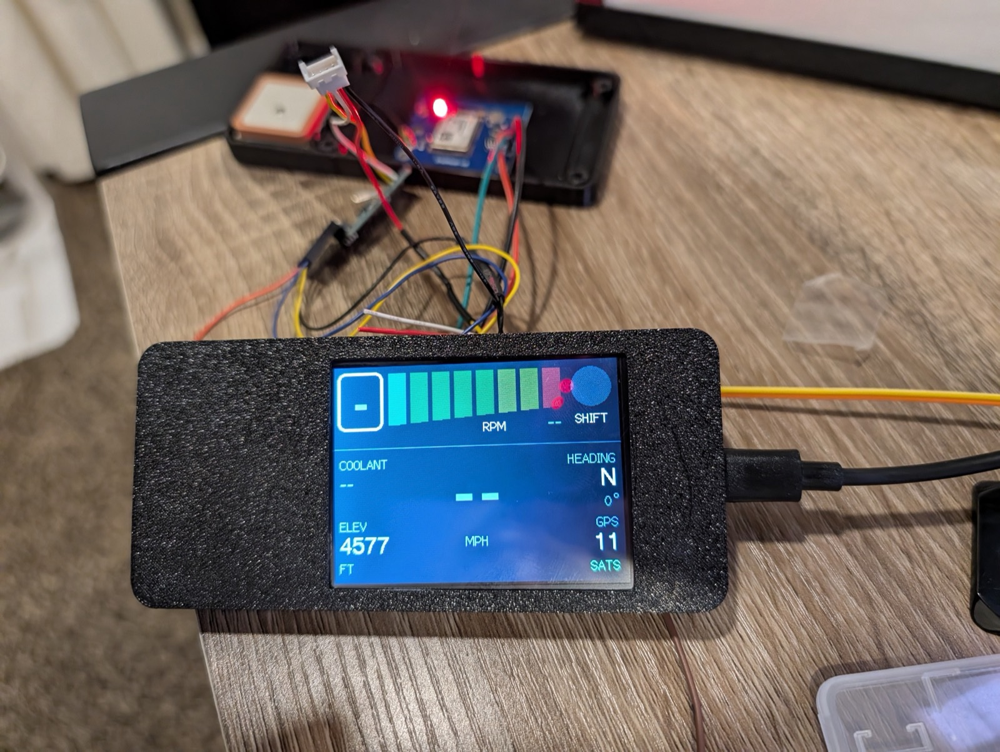
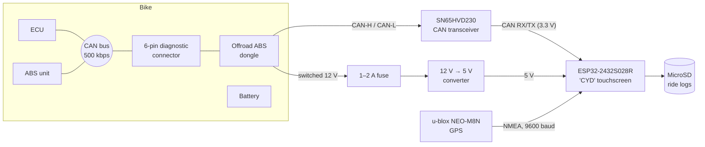
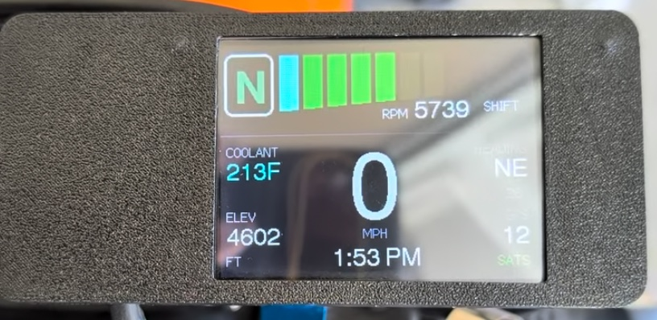
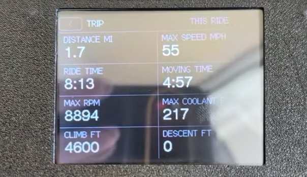
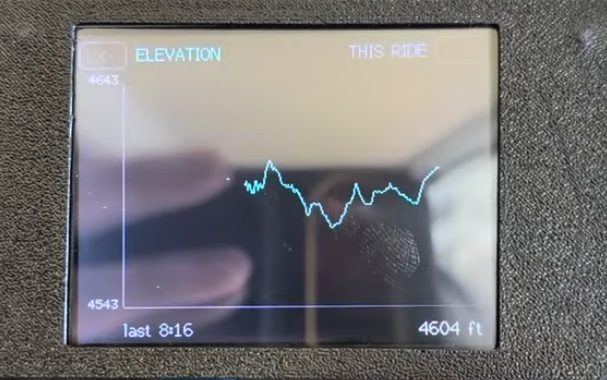
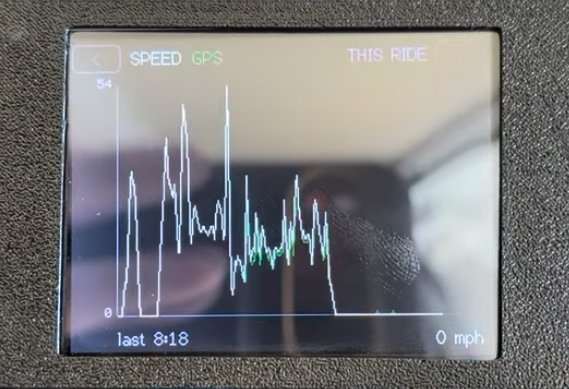
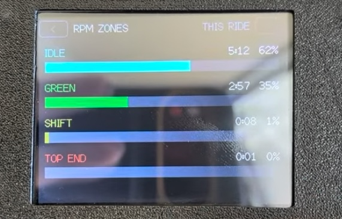
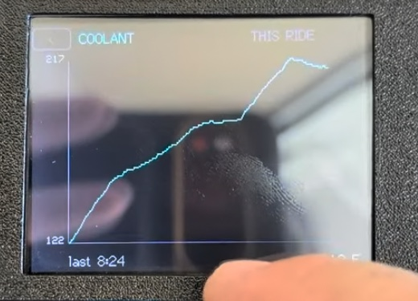
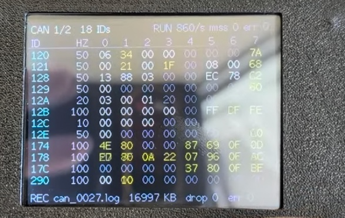

# KTM Computer

A DIY dashboard and data logger for a **2020 KTM 690 Enduro R**, which has
no instrument cluster. An ESP32 "Cheap Yellow Display" reads the bike's
factory CAN bus (read-only) and a GPS module, shows a live dash on a 2.8"
touchscreen, keeps trip stats and charts, and logs everything to a MicroSD
card.

## What it does

- **Dashboard:** RPM with a colour-zoned tach bar and shift light, gear,
  speed (from the wheel sensor), coolant temperature, GPS heading,
  elevation, satellites, and the local time from GPS.
- **Trip and history pages:** distance, ride and moving time, maximums,
  climb and descent; charts of elevation, speed (wheel vs GPS) and coolant;
  time in each RPM zone. Every ride is saved, and `<` `>` buttons step
  through past rides.
- **CAN sniffer pages:** every CAN ID on the bus with its rate and live
  bytes, for reverse-engineering more signals.
- **Logging:** every CAN frame and GPS sentence to the SD card, one file per
  key-on, oldest deleted automatically when the card fills.
- **Read-only:** the CAN controller runs in listen-only mode. See the
  [wiring guide](docs/wiring.md#make-the-tap-truly-read-only) for the
  hardware change that guarantees it.

## Compatibility

| Bike | Years | Status |
|---|---|---|
| **KTM 690 Enduro R** | 2020 | **Built and tested** |
| KTM 690 Enduro R / SMC R | 2019+ | Same platform and electronics; should work |
| Husqvarna 701 Enduro / Supermoto | 2019+ era | Same platform and Bosch cornering ABS; should work, untested |
| GasGas ES 700 / SM 700 | 2022+ | Built on the same 690 platform; should work, untested |
| KTM 690 Enduro / SMC, older generation | pre-2019 | Different electronics (no IMU or cornering ABS); CAN signals probably differ, untested |

"Should work" means the hardware and logging will work and the
[CAN decoding](docs/can-signals.md) very likely matches; any differences
show up on the CAN sniffer pages and are a small code change.

**Diagnostic connector.** The tap is the 6-pin diagnostic connector under
the seat, near the battery's negative terminal:

- **2019–2020 (pre-Euro 5):** white connector (the tested bike).
- **2021+ (Euro 5):** most markets moved to a red connector with a
  different pin layout for the CAN wires. North American bikes may have kept
  the white one, so check the bike rather than going by year.

Either works: the [wiring guide](docs/wiring.md#finding-the-wires-with-a-meter)
finds the CAN pair, ground and switched 12 V with a meter, so wire colours
and pin positions don't need to match the tested bike.

**The offroad ABS dongle isn't required.** The tested bike splices into the
dongle's wires because one was fitted. Without one, splice into the bike
side of the diagnostic connector, or build a plug-in harness with the
mating 6-pin connector (Sumitomo MT 090 series) so nothing on the bike gets
cut.

## Screenshots

From a ride on the bike.

| | |
|---|---|
|  |  |
| **Dashboard** | **Trip** |
|  |  |
| **Elevation** | **Speed** (wheel, with GPS in green) |
|  |  |
| **RPM zones** | **Coolant** |
|  | |
| **CAN sniffer** | |

## Documentation

| Doc | What's in it |
|---|---|
| [Parts list](docs/parts-list.md) | Everything used in the build |
| [Wiring](docs/wiring.md) | Every wire: bike, power, transceiver, GPS, with pin tables |
| [Build guide](docs/build-guide.md) | Step by step: tools, flashing, wiring, testing on the bike |
| [Using the dash](docs/using-the-dash.md) | Pages, taps, long presses, ride history |
| [CAN signals](docs/can-signals.md) | What each CAN ID and byte means on this bike |
| [Log format](docs/log-format.md) | What's in the SD card logs and how to read them |
| [Firmware](docs/firmware.md) | Code layout, tests, settings you might change |
| [Troubleshooting](docs/troubleshooting.md) | Problems hit during the build and how they were found |
| [Roadmap](docs/roadmap.md) | What's done and what's next |
| [Case](hardware/case/README.md) | 3D-printable case (STL) |
| [Captures](captures/README.md) | Raw CAN logs from the bike |

## Quick start (firmware)

1. Install [VS Code](https://code.visualstudio.com/) and the
   [PlatformIO](https://platformio.org/install/ide?install=vscode) extension.
2. Clone this repo and open the folder in VS Code.
3. Plug the CYD into the computer by USB and press **Upload** in the
   PlatformIO toolbar (or run `pio run -e esp32dev -t upload`).
4. Run the unit tests on the computer with `pio test -e native`.

See the [build guide](docs/build-guide.md) for the hardware.

## Credits

The starting point for the CAN decoding is
[blalor/ktm-can](https://github.com/blalor/ktm-can), also from a 2020 690
Enduro R, built on Dan Plastina's SuperDuke 1290 work on ADVrider. This
project confirmed and extended it from its own ride logs.

## License

**Free for personal and other noncommercial use.**

- **Code** (`src/`, `lib/`, `test/`, `platformio.ini`):
  [PolyForm Noncommercial 1.0.0](LICENSE)
- **Docs, images, 3D files and captures:**
  [CC BY-NC-SA 4.0](LICENSE-docs.md): credit this project and share
  adapted versions under the same terms

Build one for your own bike, modify it, share it with friends and
clubs: all fine.

### Commercial use

Selling kits or finished units, including this in a product, or charging to
install it needs a commercial license. To ask, open an issue using the
[**Commercial license request**](https://github.com/ChickenPoptart/KTMComputer/issues/new?template=commercial-license.md)
template.

### Earlier versions

Versions published before 9 October 2026 (up to commit `f2c9ddf`) were
released under the MIT License, and anyone who got a copy of those versions
keeps the MIT terms for them.
