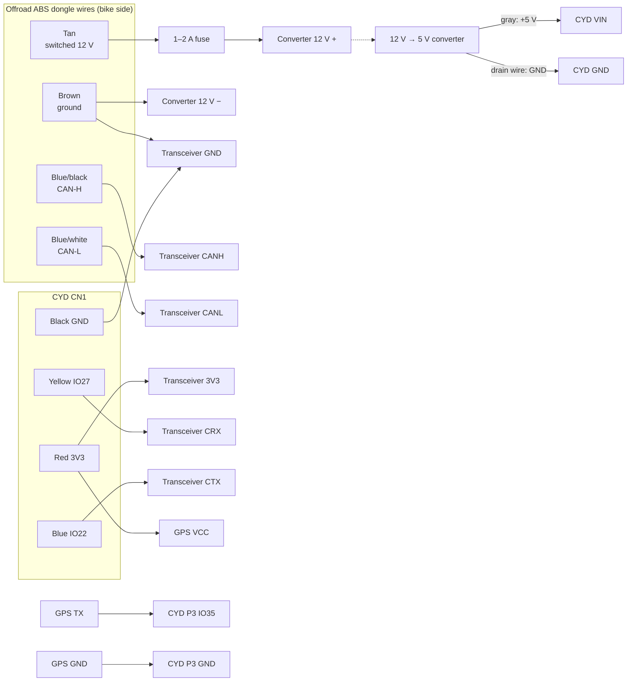

# Wiring

Every wire in the build. Wire colours on the bike side are from this
bike's offroad ABS dongle (2020, white pre-Euro 5 diagnostic connector);
**confirm yours with a meter** before cutting anything (see
[Finding the wires](#finding-the-wires-with-a-meter)). Other model years
and connectors are covered under [Compatibility](../README.md#compatibility).



## 1. Bike: the offroad ABS dongle

The dongle plugs into the bike's 6-pin diagnostic connector under the seat
(below the ECU). The dash splices into the **dongle's** wires, so the
dongle has to stay plugged in.

| Dongle wire | Signal | Goes to |
|---|---|---|
| **Tan** | Switched 12 V (live only with the key on) | Inline **1–2 A fuse**, then converter 12 V **+** |
| **Brown** | Ground | Converter 12 V **−**, and transceiver **GND** |
| **Blue/black** | **CAN-H** | Transceiver **CANH** |
| **Blue/white** | **CAN-L** | Transceiver **CANL** |

- Run CAN-H and CAN-L on **one twisted pair** of Cat5e/6, untwisted as little
  as possible at the ends. Use a spare conductor for ground.
- Keep the branch from the dongle to the transceiver short (a foot or two).
- Take both grounds (converter − and transceiver GND) from the **same**
  brown-wire splice point.
- **Tan never connects to the CYD, transceiver or GPS.** 12 V destroys them.

## 2. Power

```
Tan (12 V, switched) ──fuse──► converter ──5 V──► CYD VIN ──► CYD 3.3 V regulator ──► CN1 red (3V3)
                                                                                          ├──► transceiver 3V3
                                                                                          └──► GPS VCC
```

Power enters only at **VIN**. The CYD makes 3.3 V and supplies it on CN1's
red wire; the transceiver and the GPS run from that.

**Converter to CYD** (a cut USB-A cable, plugged into the converter):

| Cable wire | CYD power connector (labelled VIN / TX / RX / GND) |
|---|---|
| **Gray** (+5 V in the cable used; check yours) | **VIN** |
| **Bare drain wire** (+ shield) | **GND** |
| Green, white (data) | Not connected; insulate each |
| — | **TX, RX: not connected** (they're the USB serial lines) |

Find +5 V in your cable with the meter on DC volts: with the converter
powered, the pair that reads **+5.0 V** (red probe on +) is power.

- Never put 5 V on 3V3, the transceiver or the GPS.
- **Don't connect USB and VIN at the same time.** Unplug the bike side
  before plugging the CYD into a computer to flash it.

## 3. CYD CN1 → CAN transceiver

| CN1 pin | Wire | ESP32 | Transceiver |
|---|---|---|---|
| 1 | Red | 3V3 | **3V3** |
| 2 | Yellow | IO27 (CAN RX) | **CRX** |
| 3 | Blue | IO22 (CAN TX) | **CTX** (see below) |
| 4 | Black | GND | **GND** |

Termination: the bike's bus already has both 120 Ω terminators (measured
**60.2 Ω** across CAN-H/CAN-L, key off, dongle plugged in). Leave the
transceiver's 120 Ω jumper **off**.

### Make the tap truly read-only

The firmware runs the CAN controller in listen-only mode: it never sends
frames or acknowledgements. But on the ESP32, a listen-only controller can
still drive **error flags** onto the bus when it sees errors (chip errata;
the workaround isn't enabled in this framework build). To make it
physically impossible for the dash to transmit:

- Disconnect the blue IO22 wire from the transceiver's **CTX**.
- Connect **CTX to 3.3 V** (the red 3V3 line).

The transceiver then holds the bus "recessive" (silent) whatever the ESP32
does. No firmware change is needed.

## 4. GPS (u-blox NEO-M8N)

| GPS pin | CYD |
|---|---|
| **VCC** | 3.3 V: splice into CN1's **red** wire |
| **GND** | **P3 GND**, or CN1's black wire |
| **TX** | **P3 IO35** (UART2 receive; IO35 is input-only, which is all it needs) |
| **RX** | Not connected; insulate it |

- P3 also carries **IO22** (the same CAN TX line as CN1) and on many boards
  **IO21** (screen backlight). Use only IO35 and GND on P3.
- Power the GPS from 3.3 V. Breakouts that accept 3.3–5 V run fine on it;
  3.3 V-only ones would be destroyed by 5 V.
- The ceramic patch faces the sky, nothing metal above it. Plastic (e.g.
  1.5 mm PETG) is fine. Keep it a few inches from the screen if possible.
- Wiring GPS RX later (from a freed RGB LED pin: GPIO 4, 16 or 17) would let
  the firmware switch the GPS to 10 Hz.

## 5. Pins used on the ESP32

| GPIO | Use |
|---|---|
| 2, 12, 13, 14, 15, 21 | Display (HSPI; 21 = backlight) |
| 5, 18, 19, 23 | MicroSD (VSPI) |
| 25, 32, 33, 36, 39 | Touch controller (bit-banged; 36 = pen IRQ) |
| 27 | CAN RX (from transceiver CRX) |
| 22 | CAN TX (to transceiver CTX, or unused after the read-only change) |
| 35 | GPS RX (from GPS TX) |
| 1 | Serial TX (USB status messages) |
| 3 | Serial RX: **disconnected in firmware**, see [troubleshooting](troubleshooting.md#the-dash-froze-on-vin-power) |

## Finding the wires with a meter

How the dongle's wires were identified. Key **off** for resistance tests.

| Test | Meter | Expect | Means |
|---|---|---|---|
| Wire pairs, key off | Ω 200 | **~60 Ω** | The CAN pair |
| Each wire to battery −, key off | Ω 200 | **~0 Ω** | Ground |
| CAN pair to battery −, key on | DC V 20 | **2.5–3.5 V** / **1.5–2.5 V** | CAN-H / CAN-L |
| Others to battery −, key on | DC V 20 | **~12 V** | Power; check it reads **0 V with the key off** to confirm it's switched |

## Checks before connecting to the bike

With the dash wiring disconnected from the bike (dongle unplugged), meter on Ω 200:

| Measure | Expect |
|---|---|
| CAN-H to GND | high / open |
| CAN-L to GND | high / open |
| CAN-H to CAN-L | high / open |
| 12 V (tan) to GND | high / open |

Then with the dongle plugged into the bike: **CAN-H to CAN-L ≈ 60 Ω** (key
off), and with the key on **both lines around 2.5 V**. If both read near
0 V, something is shorting the bus to ground (see
[troubleshooting](troubleshooting.md#a-melted-wire-shorted-the-bus)).
